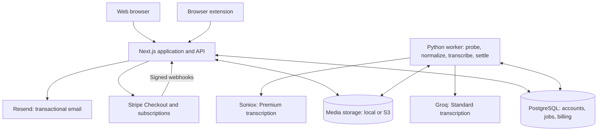

# Transcribe

**Audio and video to editable, timestamped transcripts.**

Transcribe is a full-stack transcription application that brings media ingestion,
background processing, payments, and transcript management into one workflow.
Users can upload a file, submit a media URL or playlist, record their microphone,
or capture tab audio through the browser extension, then review and export the
result as TXT, SRT, or VTT.

Built by [addefrr](https://github.com/addefrr).
The source is proprietary; see [License](#license) for usage restrictions.

## Features

- **Multiple input methods:** audio/video uploads, public media links, YouTube
  playlists, microphone recording, and a Manifest V3 browser extension.
- **Two transcription tiers:** Standard uses Groq's Whisper Large V3 Turbo;
  Premium uses Soniox async transcription with optional speaker labels.
- **Transcript workspace:** timestamped playback, text corrections with undo,
  folders, revocable share links, and subtitle/text downloads.
- **Payments and plans:** Stripe Checkout, subscriptions with minute allowances,
  and backup credits for usage beyond the plan.
- **Account controls:** email verification, password reset, revocable API tokens,
  account data export, and account deletion.
- **Developer portal:** configurable pricing, plan allowances, signup credits,
  and usage and cost reporting.

## Technology

| Layer | Implementation |
| --- | --- |
| Web application | Next.js 15 App Router, React 19, TypeScript, Tailwind CSS 4 |
| Database | PostgreSQL, Drizzle ORM, versioned SQL migrations |
| Background processing | Python 3.11+, psycopg, yt-dlp, ffmpeg |
| Speech recognition | Groq and Soniox APIs; local faster-whisper and fake backends for development |
| Storage | Shared local filesystem or S3-compatible object storage |
| Payments and email | Stripe and Resend |
| Browser extension | JavaScript, Manifest V3, token-authenticated API |
| Development and CI | Docker Compose, Make, GitHub Actions, Python unittest |

## Architecture



The web application handles authentication, submissions, billing, and the
transcript workspace. A separate Python worker performs media downloads,
normalization, transcription, and credit settlement, keeping long-running work
out of HTTP requests. The browser polls the job API for progress and results.

### Engineering decisions

- **PostgreSQL as the job queue.** Workers claim jobs with
  `FOR UPDATE SKIP LOCKED`, allowing multiple worker processes without a
  separate message broker. Per-user locking enforces concurrency limits.
- **Reserve, then settle.** Jobs reserve plan minutes and backup credits before
  transcription. Completion settles actual usage, while failures release holds.
  Credit movements are recorded in a ledger, and each job retains its submitted
  rate so later pricing changes do not alter that job's billing.
- **Confirm URL costs before processing.** The worker probes remote media first;
  users review the measured duration and plan/credit split before paid
  transcription begins.
- **Provider isolation.** Routing and provider adapters separate the media
  pipeline from vendor APIs. A fake backend exercises the workflow locally
  without making paid transcription requests.
- **Retry-aware integrations.** Stripe webhook handling verifies signatures and
  deduplicates events. Storage cleanup keeps failed deletions eligible for retry.
- **Explicit access and retention controls.** Authentication uses Argon2id and
  hashed session tokens. Uploads are bound to verified accounts, URLs undergo
  SSRF checks in both services, and retained playback audio has a configurable
  lifetime. Workers still need network isolation to limit residual URL-fetch risks.

## Code tour

| Area | Starting point |
| --- | --- |
| Submission and transcript UI | [`NewJobForm.tsx`](web/src/components/NewJobForm.tsx), [`JobDetail.tsx`](web/src/components/JobDetail.tsx) |
| API endpoints | [`web/src/app/api/`](web/src/app/api/) |
| Data model and migrations | [`schema.ts`](web/src/lib/schema.ts), [`web/drizzle/`](web/drizzle/) |
| Billing and credit accounting | [`wallet.ts`](web/src/lib/wallet.ts), [`credits.ts`](web/src/lib/credits.ts), [`subscriptions.ts`](web/src/lib/subscriptions.ts) |
| Worker pipeline and job coordination | [`pipeline.py`](worker/worker/pipeline.py), [`db.py`](worker/worker/db.py) |
| Transcription routing | [`routing.py`](worker/worker/routing.py), [`providers/`](worker/worker/providers/) |
| Browser capture | [`extension/`](extension/), [extension documentation](extension/README.md) |
| Automated checks | [`quality.yml`](.github/workflows/quality.yml), [`worker/tests/`](worker/tests/) |

## Maintainer development

These instructions document the author's development workflow and do not grant
permission to run or reuse the project.

Prerequisites: Node.js 20+, npm, Python 3.11+ with venv support, ffmpeg/ffprobe,
Docker Compose, and GNU Make. The Makefile's background process commands target
a Linux environment with `setsid` and `nohup`.

From the repository root:

```sh
make setup
# Edit web/.env using the configuration notes below.
make dev
```

`make setup` creates `web/.env` from [`.env.example`](.env.example), installs web
and worker dependencies, starts PostgreSQL, and applies migrations. `make dev`
checks dependencies, waits for the database, applies migrations, and starts the
web app and worker. The app is available at `http://localhost:3000`.

For a local demonstration without provider credentials, set these in `web/.env`
before starting the services:

```dotenv
TRANSCRIBE_BACKEND=fake
DEV_FAKE_CHECKOUT=1
```

The fake backend returns canned transcripts, and fake checkout adds test credits
without Stripe. With `RESEND_API_KEY` unset in development, verification and
password-reset emails are printed in the web server log. Sign up, follow the
verification link from `make logs-web`, and submit a short clip.

Use `make status`, `make logs`, `make restart`, and `make stop` to manage the
local services. Development overrides must be disabled for production.

### Configuration and deployment

[`.env.example`](.env.example) documents database access, provider credentials,
storage, email, billing, retention, and processing limits. Hosted transcription
uses `GROQ_API_KEY` and `SONIOX_API_KEY`; payments use `STRIPE_SECRET_KEY` and
`STRIPE_WEBHOOK_SECRET`.

The current deployment target is a **Node.js web host plus a separate Python
worker**, backed by PostgreSQL. Local storage requires both services to share a
persistent filesystem; separate hosts need S3-compatible storage such as R2.
The worker also has a [Dockerfile](worker/Dockerfile).

Cloudflare can provide DNS/CDN and R2 storage. The repository does not currently
include a Cloudflare Workers/OpenNext deployment setup, and its native Argon2
dependency needs runtime compatibility work before that target can be supported.

`make connect` documents provider configuration and required Stripe webhook
events. `make production-check` checks configuration and builds the Node.js web
app; it does not validate an end-to-end production deployment.

## Validation

The [GitHub Actions workflow](.github/workflows/quality.yml) applies migrations
to a fresh PostgreSQL database, lints and type-checks the web application, builds
it, compiles Python modules, and runs the worker unit tests. Worker tests cover
provider routing, Soniox responses, allowance windows, spend budgets, and storage
cleanup.

After local setup, the corresponding application checks can be run with:

```sh
cd web
npm run check
```

```sh
cd worker
.venv/bin/python -m compileall -q worker tests
.venv/bin/python -m unittest discover -s tests -v
```

## License

**Copyright (c) 2026 addefrr. All rights reserved.**

No permission is granted to use, run, copy, modify, distribute, sublicense, sell,
deploy, or create derivative works from the project, for either commercial or
noncommercial purposes. Rights required by applicable law or GitHub's terms for
viewing and forking a public repository are unaffected. Third-party dependencies
remain subject to their own licenses. See [LICENSE](LICENSE) for the full notice.
